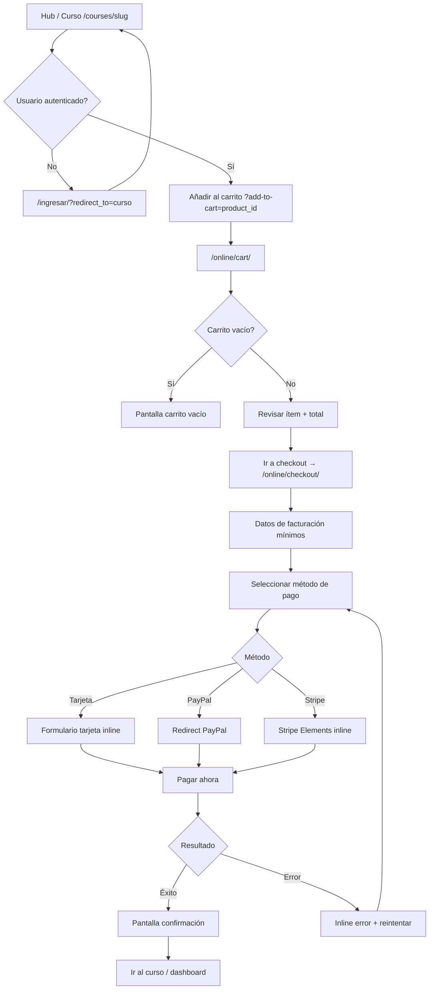
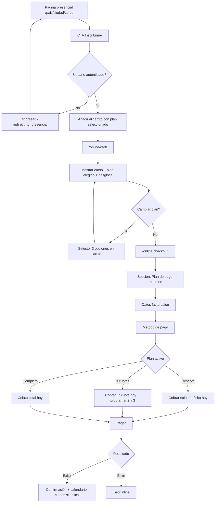

# Especificación de diseño: flujo de checkout y pago

**Proyecto:** ESITEF Online — tema `esitef-minimal`  
**Versión:** 1.0  
**Fecha:** Julio 2026  
**Alcance:** `/online/cart/` → `/online/checkout/` → confirmación  
**Prototipo interactivo:** [`preview-checkout.html`](../../preview-checkout.html) (raíz del repositorio)

---

## 1. Resumen y objetivos

### 1.1 Contexto

La plataforma ESITEF Online vende dos tipos de producto con modelos de pago distintos:

| Tipo | Modelo de pago | Métodos |
|------|----------------|---------|
| **Formaciones online** | Pago único | PayPal, tarjeta crédito/débito, Stripe |
| **Formaciones presenciales** | Reserva (depósito), 3 cuotas mensuales, pago completo | PayPal, tarjeta crédito/débito, Stripe |

**Estado actual del código:**
- Online: flujo WooCommerce estándar vía Tutor LMS (`inc/woocommerce.php`). Sin plantillas custom de carrito/checkout.
- Presencial: flujo manual (transferencia + WhatsApp/email). **No existe** selector de planes ni motor de cuotas.

Esta especificación define el **UX objetivo** (ideal) para ambos recorridos, alineado al sistema de diseño del tema. La implementación backend (productos WC por plan, suscripciones/cuotas) queda fuera de alcance.

### 1.2 Objetivos de diseño

1. **Mobile-first:** optimizar para pantallas ≤ 390 px; escritorio como expansión progresiva.
2. **Claridad de pago:** el usuario debe entender en < 3 s qué paga hoy y qué queda pendiente.
3. **Mínima fricción:** un solo scroll vertical en móvil; campos reducidos; valores predeterminados inteligentes.
4. **Coherencia de marca:** tokens de `style.css`, tipografía triple (Bricolage / Inter / Inconsolata), módulos shell+card.
5. **Inspiración:** Udemy (lista clara de métodos), Domestika (resumen sticky + confirmación compacta).

### 1.3 Principios mobile-first

- Resumen de pedido **sticky** en la parte inferior en móvil (barra de total + CTA).
- Métodos de pago como **tarjetas seleccionables** (radio visual), no dropdown.
- Plan presencial: **3 tarjetas apiladas** en móvil; fila horizontal en escritorio (≥ 768 px).
- Inputs con `font-size: 16px` mínimo (evita zoom iOS).
- Tap targets ≥ 44 × 44 px.
- Teclado numérico para campos de tarjeta y teléfono.

---

## 2. Tokens del sistema de diseño

Fuente: [`style.css`](../style.css), [`formacion-hub.css`](../assets/css/pages/formacion-hub.css), [`auth.css`](../assets/css/pages/auth.css).

### 2.1 Colores

| Token | Valor | Uso en checkout |
|-------|-------|-----------------|
| `--color-bg` | `#ffffff` | Fondo página |
| `--color-text-main` | `#282828` | Texto principal |
| `--color-text-muted` | `#696969` | Metadatos, subtítulos |
| `--color-border` | `#e5e5e5` | Divisores, bordes inactivos |
| `--color-primary` | `#e3203a` | CTAs, focus, selección activa |
| `--color-primary-hover` | `#b3192e` | Hover CTAs |
| `--esitef-shell-bg` | `#f2f2f2` | Contenedor exterior de secciones |
| `--esitef-card-bg` | `#ffffff` | Tarjetas internas |
| `--color-success` | `#1a9e5c` | Confirmación, badges "ahorro" |
| `--color-success-bg` | `#f0faf4` | Fondo éxito |
| `--color-error` | `#b3192e` | Errores validación |
| `--color-error-bg` | `#fdecee` | Fondo alerta error |
| `--color-warning` | `#b89b14` | Avisos (cuotas pendientes) |
| `--color-warning-bg` | `#fdf5d3` | Fondo aviso |

> **Decisión:** unificar en `#e3203a` (no usar `#E3000F` legacy en checkout).

### 2.2 Tipografía

| Rol | Familia | Pesos | Ejemplo |
|-----|---------|-------|---------|
| Títulos / precios | Bricolage Grotesque | 400–600 | "Finalizar compra", total |
| Cuerpo / descripciones | Inter | 300–500 | Nombre curso, features plan |
| Labels / botones / eyebrows | Inconsolata | 400–600 | "MÉTODO DE PAGO", CTA |

**Escala tipográfica (checkout):**

| Elemento | Móvil | Escritorio |
|----------|-------|------------|
| Título página | `clamp(1.5rem, 5vw, 2rem)` | `2rem` |
| Precio total | `28px` w600 | `36px` w600 |
| Nombre producto | `16px` w500 | `17px` w500 |
| Label campo | `12px` Inconsolata | `14px` |
| Input | `16px` Inter | `16px` |
| CTA principal | `14px` Inconsolata, `letter-spacing: 0.06em` | igual |
| Badge / chip | `11px` w600 uppercase | igual |

### 2.3 Espaciado y radios

| Token | Valor |
|-------|-------|
| `--esitef-shell-radius` | `36px` |
| `--esitef-card-radius` | `28px` |
| `--radius-md` | `8px` |
| `--container-width` | `1200px` |
| Padding página | `20px` horizontal |
| Gap entre secciones | `16px` móvil / `24px` escritorio |
| Gap interno card | `16px`–`24px` |

### 2.4 Sombras

| Uso | Valor |
|-----|-------|
| Card reposo | `0 4px 20px rgba(0,0,0,0.02)` |
| Card hover/seleccionada | `0 12px 30px rgba(0,0,0,0.06)` |
| Plan destacado | `0 12px 40px rgba(227,32,58,0.12)` |
| Sticky bar móvil | `0 -4px 20px rgba(0,0,0,0.08)` |
| CTA glow | `0 6px 16px rgba(227,32,58,0.4)` |

### 2.5 Convención de nombres (BEM)

Prefijo de bloque: `checkout-`  
Ejemplos: `checkout-cart`, `checkout-method`, `checkout-plan`, `checkout-summary`.

---

## 3. Diagramas de flujo

### 3.1 Formaciones online (pago único)



### 3.2 Formaciones presenciales (tres opciones)



---

## 4. Pantallas y layouts

### 4.1 Estructura global (todas las pantallas)

**Móvil (base):**
```
┌─────────────────────────────┐
│ Breadcrumb: Inicio › Carrito│
├─────────────────────────────┤
│ Título de sección           │
│ ┌─────────────────────────┐ │
│ │ esitef-module-shell     │ │
│ │ ┌─────────────────────┐ │ │
│ │ │ esitef-module-card  │ │ │
│ │ │ [contenido]         │ │ │
│ │ └─────────────────────┘ │ │
│ └─────────────────────────┘ │
│ ...más secciones...         │
├─────────────────────────────┤
│ ░ STICKY SUMMARY BAR ░░░░░░ │ ← fixed bottom
│ Total: $XX  [Continuar]     │
└─────────────────────────────┘
```

**Escritorio (≥ 992 px):**
```
┌──────────────────────────────────────────────────┐
│ Breadcrumb                                       │
├────────────────────────┬─────────────────────────┤
│ Columna principal      │ Sidebar resumen (sticky)│
│ (60%)                  │ (40%, top: 80px)        │
│ - Productos            │ - Líneas de precio      │
│ - Plan (presencial)    │ - Total hoy             │
│ - Facturación          │ - CTA primario          │
│ - Método de pago       │ - Trust badges          │
└────────────────────────┴─────────────────────────┘
```

### 4.2 Pantalla: Carrito (`/online/cart/`)

#### Online — un ítem

| Zona | Contenido |
|------|-----------|
| Card producto | Thumbnail 80×80, título, badge "Online", precio unitario |
| Resumen | Subtotal, impuestos (si aplica), **Total** |
| CTA | "Ir al checkout" (primario) + "Seguir explorando" (texto) |

#### Presencial — con selector de plan

Antes del resumen, bloque **"Elige tu forma de pago"** con 3 tarjetas (reutiliza patrón `.hub-plan`):

| Plan | Ejemplo (Córdoba) | Cobro hoy | Resto |
|------|-------------------|-----------|-------|
| **Reserva** | $100.000 ARS | $100.000 ARS | $350 USD día del curso |
| **3 cuotas** | 3 × $150.000 ARS | $150.000 ARS | 2 cuotas automáticas mes 2 y 3 |
| **Pago completo** | $400.000 ARS | $400.000 ARS (5% dto.) | — |

- Plan **3 cuotas** lleva badge `Recomendado` y clase `--highlight`.
- Al seleccionar plan, el resumen se actualiza en tiempo real (sticky bar incluida).

#### Carrito vacío

- Ilustración/icono carrito gris
- Título: "Tu carrito está vacío"
- CTA: "Explorar formaciones"
- Sin sticky bar

### 4.3 Pantalla: Checkout (`/online/checkout/`)

Checkout de **una sola página** con secciones colapsables en móvil (acordeón suave; todas expandidas en escritorio).

**Orden de secciones:**

1. **Resumen del pedido** (colapsado en móvil tras scroll; expandido al inicio)
2. **Plan de pago** (solo presencial; solo lectura con enlace "Cambiar" → carrito)
3. **Datos de facturación** (campos mínimos)
4. **Método de pago**
5. **Términos y CTA**

#### Campos de facturación (mínimos)

| Campo | Requerido | Default |
|-------|-----------|---------|
| Nombre | Sí | Perfil WP |
| Apellidos | Sí | Perfil WP |
| Email | Sí | Usuario logueado |
| País | Sí | Geo-IP o último pedido |
| Teléfono | Condicional* | Perfil |

*Teléfono requerido solo para presencial (contacto logística).

#### Método de pago — lista vertical

```
┌─────────────────────────────────────┐
│ ◉ Tarjeta de crédito o débito        │
│   [Visa] [MC] [Amex]                │
│   ┌───────────────────────────────┐ │
│   │ Número de tarjeta               │ │
│   │ MM/AA    CVC                    │ │
│   │ Nombre en la tarjeta            │ │
│   └───────────────────────────────┘ │
├─────────────────────────────────────┤
│ ○ PayPal                            │
│   Pagarás en el sitio de PayPal     │
├─────────────────────────────────────┤
│ ○ Stripe                            │
│   Pago seguro procesado por Stripe  │
└─────────────────────────────────────┘
```

- Tarjeta **expandida por defecto**; PayPal/Stripe muestran solo una línea hasta seleccionarse.
- Logos de métodos a 32 px altura, escala de grises → color al activo.

### 4.4 Pantalla: Confirmación (post-pago)

**Online:**
- Icono check verde en círculo `#f0faf4`
- "¡Compra confirmada!"
- Número de pedido, email de confirmación
- Card del curso con CTA **"Empezar ahora"** → primera lección
- Enlace secundario: "Ver mis cursos"

**Presencial — según plan:**

| Plan | Mensaje adicional |
|------|-------------------|
| Reserva | "Has reservado tu plaza. Recuerda: $350 USD el día del curso." |
| 3 cuotas | Tabla: Cuota 1 ✓ hoy, Cuota 2 — fecha, Cuota 3 — fecha |
| Completo | "¡Inscripción completa! Te enviaremos detalles logísticos." |

---

## 5. Especificación de componentes

### 5.1 Botones

#### Primario (`checkout-btn--primary`)

```css
height: 50px;
padding: 0 28px;
border-radius: 50px;
background: var(--color-primary);
color: #fff;
font-family: 'Inconsolata', monospace;
font-size: 14px;
font-weight: 500;
letter-spacing: 0.06em;
```

| Estado | Estilo |
|--------|--------|
| Hover | `background: #b3192e; transform: translateY(-1px)` |
| Active | `transform: scale(0.98)` |
| Disabled | `opacity: 0.5; pointer-events: none` |
| Loading | Texto → spinner 20px + "Procesando…" |

#### Secundario / ghost (`checkout-btn--ghost`)

- Fondo transparente, borde `1px solid #ddd`, texto `#111`
- Hover: borde `#111`

#### Texto (`checkout-btn--text`)

- Sin fondo, color `#696969`, underline on hover

### 5.2 Campos de formulario (`checkout-field`)

Basado en patrón `login-field` de `auth.css`:

```css
.checkout-field label {
  font-family: 'Inconsolata', monospace;
  font-size: 12px;
  color: #555;
  margin-bottom: 8px;
}
.checkout-field input {
  height: 48px;
  border: none;
  border-bottom: 1.5px solid #ddd;
  font-family: 'Inter', sans-serif;
  font-size: 16px;
}
.checkout-field input:focus {
  border-bottom-color: var(--color-primary);
  outline: none;
}
.checkout-field--error input {
  border-bottom-color: var(--color-error);
}
.checkout-field__error {
  font-size: 12px;
  color: var(--color-error);
  margin-top: 4px;
}
```

**Grid tarjeta (móvil):** número full-width; MM/AA + CVC en fila 50/50.

### 5.3 Selector de método de pago (`checkout-method`)

| Parte | Spec |
|-------|------|
| Contenedor | `border: 1.5px solid #e5e5e5; border-radius: 16px; overflow: hidden` |
| Opción | `padding: 16px 20px; min-height: 56px; cursor: pointer` |
| Opción activa | `border-color: #e3203a; background: #fffafa` |
| Radio visual | Círculo 20px, borde `#ddd`; activo: relleno `#e3203a` |
| Panel expandido | `padding: 0 20px 20px; border-top: 1px solid #eee` |

**Accesibilidad:** `<input type="radio" class="visually-hidden">` + `<label>` asociado; `role="radiogroup"` en contenedor.

### 5.4 Tarjetas de plan presencial (`checkout-plan`)

Extiende `.hub-plan` de `formacion-hub.css`:

| Elemento | Clase | Notas |
|----------|-------|-------|
| Contenedor | `checkout-plan` | `border: 1.5px solid #e5e5e5; border-radius: 24px; padding: 20px` |
| Destacado | `checkout-plan--highlight` | Borde `#e3203a`, sombra roja |
| Seleccionado | `checkout-plan--selected` | Borde `#e3203a` + radio filled |
| Nombre | `checkout-plan__name` | Bricolage 18px w600 |
| Precio hoy | `checkout-plan__amount` | Bricolage 28px w600, color `#e3203a` |
| Periodo | `checkout-plan__period` | Inter 13px `#888` |
| Features | `checkout-plan__features` | Lista con checkmarks |
| Badge | `checkout-plan__badge` | Pill `#e3203a` blanco, "Recomendado" |

**Interacción:** click en toda la tarjeta selecciona el plan; actualiza resumen vía JS.

### 5.5 Resumen de pedido (`checkout-summary`)

| Fila | Estilo |
|------|--------|
| Label | Inter 14px `#666` |
| Valor | Inter 14px `#111`, alineado derecha |
| Descuento | Valor en `#1a9e5c` |
| Separador | `1px solid #eee` |
| **Total hoy** | Bricolage 20px w600 |
| Nota cuotas | Inter 12px `#888` italic bajo total |

**Sticky móvil (`checkout-summary-bar`):**
- `position: fixed; bottom: 0; left: 0; right: 0`
- `background: rgba(255,255,255,0.95); backdrop-filter: blur(8px)`
- `padding: 12px 20px; padding-bottom: max(12px, env(safe-area-inset-bottom))`
- Muestra: "Total hoy: $X" + botón compacto

### 5.6 Badges y chips

| Badge | Uso | Estilo |
|-------|-----|--------|
| `checkout-badge--online` | Tipo producto | `#f2f2f2` fondo, Inter 11px |
| `checkout-badge--presencial` | Tipo producto | `#fdf5d3` fondo, `#b89b14` texto |
| `checkout-badge--saving` | Descuento pago completo | `#f0faf4` fondo, `#1a9e5c` texto |

### 5.7 Breadcrumb (`checkout-breadcrumb`)

Reutilizar `.hub-breadcrumb`: sticky top, Inter 13px, separador `›`.

Pasos: `Inicio › Carrito › Checkout › Confirmación`

---

## 6. Variaciones de estado

### 6.1 Carga (loading)

| Contexto | Comportamiento |
|----------|----------------|
| Página inicial | Skeleton cards (rectángulos `#f2f2f2` animados) |
| Cambio de plan | Opacity 0.6 en resumen + spinner 16px junto al total |
| Submit pago | CTA → spinner + "Procesando…"; form deshabilitado |
| Redirect PayPal | Overlay semitransparente + "Redirigiendo a PayPal…" |

### 6.2 Error

| Tipo | Presentación |
|------|--------------|
| Validación campo | Mensaje bajo input (`checkout-field__error`), borde rojo |
| Pago rechazado | Banner superior `#fdecee`: "No pudimos procesar tu pago. Revisa los datos o prueba otro método." |
| Red / timeout | Banner + botón "Reintentar" |
| Carrito expirado | Modal: "Tu reserva expiró" + CTA volver al curso |

### 6.3 Éxito

- Transición suave (fade-in 300ms)
- Confeti sutil opcional (solo desktop, `prefers-reduced-motion: reduce` → desactivar)
- Email confirmación mencionado
- CTA primario above the fold

### 6.4 Vacío

- Carrito sin ítems (ver §4.2)
- Sin estados parciales en checkout (redirect a carrito si vacío)

### 6.5 Plan presencial — desglose dinámico

Al cambiar plan, animar el total con `transition: opacity 0.2s`:

| Plan | Líneas resumen |
|------|----------------|
| Reserva | Depósito hoy · Restante (informativo, no cobrado) |
| 3 cuotas | Cuota 1 hoy · Cuota 2 (fecha) · Cuota 3 (fecha) · Total |
| Completo | Precio tachado (si dto.) · Precio final · Ahorro |

---

## 7. Patrones de interacción y validación

### 7.1 Flujo de interacción

1. **Selección de plan (presencial):** en carrito, obligatorio antes de checkout. Un plan activo a la vez.
2. **Persistencia:** plan guardado en sesión/carrito WC como meta del ítem.
3. **Cambio de plan:** permitido en carrito; en checkout solo vía enlace "Cambiar plan".
4. **Método de pago:** un método activo; cambiar colapsa el anterior.
5. **Submit:** un solo botón "Pagar $X" (muestra monto de hoy, no total del curso si es reserva/cuotas).

### 7.2 Reglas de validación

| Campo | Regla | Momento |
|-------|-------|---------|
| Nombre / Apellidos | ≥ 2 caracteres, sin solo espacios | on blur |
| Email | RFC 5322 simplificado | on blur |
| Teléfono | E.164 o mín. 8 dígitos | on blur (presencial) |
| Número tarjeta | Luhn + 13–19 dígitos | on blur |
| Expiración | MM/AA futuro | on blur |
| CVC | 3–4 dígitos | on blur |
| Términos | Checkbox marcado | on submit |

**Errores:** no bloquear submit silenciosamente; foco al primer campo con error; `aria-invalid="true"`.

### 7.3 Valores predeterminados

- Autocompletar desde perfil WP (`billing_first_name`, etc.)
- País según último pedido o `WC()->customer->get_billing_country()`
- Método de pago: tarjeta (más común)
- Plan presencial: **3 cuotas** preseleccionado (recomendado)

### 7.4 Microcopy (ES)

| Contexto | Texto |
|----------|-------|
| CTA carrito | "Ir al checkout" |
| CTA checkout | "Pagar {monto}" |
| PayPal hint | "Serás redirigido a PayPal para completar el pago." |
| Stripe hint | "Pago seguro con encriptación de extremo a extremo." |
| Cuotas | "Las cuotas 2 y 3 se cobrarán automáticamente cada 30 días." |
| Reserva | "El resto se paga el día del curso en la sede." |
| Seguridad | "🔒 Pago seguro · SSL · No almacenamos datos de tarjeta" |

---

## 8. Accesibilidad

### 8.1 WCAG 2.1 AA

| Criterio | Implementación |
|----------|----------------|
| Contraste texto | `#282828` sobre `#fff` = 12.6:1 ✓ |
| Contraste CTA | `#fff` sobre `#e3203a` = 4.7:1 ✓ |
| Focus visible | `outline: 2px solid #e3203a; outline-offset: 2px` en todos los interactivos |
| Labels | Todo input con `<label>` visible o `aria-label` |
| Grupos | `role="radiogroup"` + `aria-labelledby` en métodos y planes |
| Errores | `aria-live="polite"` en región de alertas |
| Idioma | `lang="es"` en `<html>` |

### 8.2 Teclado

- Tab order: breadcrumb → productos → plan → campos → métodos → términos → CTA
- Enter/Space selecciona tarjeta de plan o método
- Escape cierra modales (error, loading overlay)

### 8.3 Screen readers

- Total anunciado al cambiar plan: `aria-live="polite"` en `checkout-summary__total`
- Estado loading en CTA: `aria-busy="true"`
- Iconos decorativos: `aria-hidden="true"`

### 8.4 Movimiento

```css
@media (prefers-reduced-motion: reduce) {
  *, *::before, *::after {
    animation-duration: 0.01ms !important;
    transition-duration: 0.01ms !important;
  }
}
```

---

## 9. Optimización móvil

| Técnica | Detalle |
|---------|---------|
| Viewport | `width=device-width, initial-scale=1` |
| Safe areas | `env(safe-area-inset-*)` en sticky bar y header |
| Input mode | `inputmode="numeric"` tarjeta/CVC; `inputmode="tel"` teléfono |
| Autocomplete | `autocomplete="cc-number"`, `cc-exp`, `cc-csc`, `email`, `tel` |
| Scroll | `scroll-margin-bottom: 80px` en campos (no quedan bajo sticky bar) |
| Lazy logos | SVG inline métodos de pago (< 2KB cada uno) |
| Touch | `-webkit-tap-highlight-color: transparent` |

**Breakpoints:**

| Nombre | Ancho | Layout |
|--------|-------|--------|
| `sm` | < 576px | 1 columna, planes apilados |
| `md` | 576–991px | 1 columna, planes en scroll horizontal opcional |
| `lg` | ≥ 992px | 2 columnas (contenido + sidebar) |

---

## 10. Datos de ejemplo (prototipo)

### Online
- **Producto:** Club de Actualización Semestral
- **Precio:** 59,90 USD
- **Thumbnail:** imagen curso

### Presencial
- **Producto:** Dolor y Movimiento — Córdoba
- **Fecha:** 15–17 Nov 2026
- **Planes:**
  - Reserva: $100.000 ARS hoy
  - 3 cuotas: 3 × $150.000 ARS (total $450.000 ARS)
  - Completo: $400.000 ARS (ahorro 11%)

---

## 11. Implementación futura (fuera de alcance)

Para llevar este diseño a producción:

1. **Plantillas WC custom:** `woocommerce/cart/cart.php`, `woocommerce/checkout/form-checkout.php`
2. **CSS:** `assets/css/pages/checkout.css` con tokens de §2
3. **Presencial → WC:** productos variables o 3 productos simples por curso; meta `_esitef_payment_plan`
4. **Cuotas:** WooCommerce Subscriptions, Stripe Billing, o gateway con split payments
5. **Hooks:** `woocommerce_cart_calculate_fees` para depósitos; `woocommerce_checkout_create_order_line_item` para meta de plan

---

## 12. Referencias

- Tema: [`esitef-minimal`](../)
- Tokens: [`style.css`](../style.css)
- Plan cards existentes: [`pricing.php`](../template-parts/pages/formacion-hub/pricing.php)
- Form fields: [`auth.css`](../assets/css/pages/auth.css)
- Prototipo: [`preview-checkout.html`](../../preview-checkout.html)
- Inspiración: [Udemy Checkout](https://www.udemy.com/payment/checkout/), [Domestika Checkout](https://www.domestika.org/es/cart/checkout)
