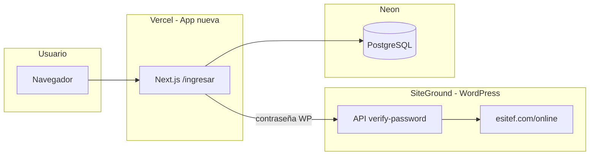

# Ventana de corte en SiteGround — paso a paso (detallado)

> Guía para quien no ha hecho un corte DNS antes. Lee primero la **Parte 0** (conceptos); luego sigue el **cronograma** en orden.

**Relacionado:** [`GO-LIVE-EXECUTION.md`](./GO-LIVE-EXECUTION.md) · [`VERCEL-PASO-A-PASO.md`](./VERCEL-PASO-A-PASO.md) · [`VERCEL-NEON-SETUP.md`](./VERCEL-NEON-SETUP.md)

---

## Parte 0 — ¿Qué estamos haciendo y por qué?

### Situación hoy

| Pieza | Dónde vive | Qué hace |
|-------|------------|----------|
| **WordPress** (Tutor + WooCommerce) | SiteGround → `esitef.com/online` | Sitio viejo: cursos, usuarios, contraseñas, imágenes |
| **App nueva** (Next.js) | Vercel → `*.vercel.app` (luego tu dominio) | Sitio nuevo: login, dashboard, player, checkout Stripe |
| **Base de datos nueva** | Neon (PostgreSQL) | Copia de usuarios, cursos y matrículas migrada desde WP |

Ya probaste que Vercel + Neon + Stripe **funcionan**. El corte es el momento en que el público deja de usar WordPress como app principal y empieza a usar la app de Vercel.

### ¿Qué es la “ventana de corte”?

Un bloque de **1–2 horas** (mejor en horario de poco tráfico) donde:

1. Congelas WordPress para que nadie compre ni cambie datos.
2. Copias los últimos datos de WP → Neon (delta final).
3. Apuntas el dominio a Vercel.
4. Verificas que todo funciona en producción.

Si algo sale mal, tienes **rollback**: vuelves el DNS a como estaba y quitas el modo solo lectura.

### ¿Por qué WordPress sigue en SiteGround después del corte?

Durante **2–4 semanas** la app nueva **no guarda contraseñas**. Cuando alguien inicia sesión, Next.js pregunta a WordPress: “¿esta contraseña es correcta?”. Eso es el **auth bridge** (puente de autenticación).

Por eso **no borras** `esitef.com/online` el día del corte. Solo lo pones en solo lectura y lo usas para validar logins.



### Glosario rápido

| Término | En castellano |
|---------|----------------|
| **DNS** | La “guía telefónica” de internet: dice si `esitef.com` va a SiteGround o a Vercel |
| **mu-plugin** | Plugin de WordPress que se activa solo al subirlo a `wp-content/mu-plugins/` (no hace falta activarlo en el panel) |
| **Auth bridge** | Endpoint en WP que verifica email + contraseña para la app nueva |
| **Solo lectura** | WP sigue visible pero bloquea compras y formularios POST |
| **Delta / ETL** | Script que copia cambios recientes de MySQL (WP) a PostgreSQL (Neon) |
| **Smoke test** | Prueba rápida manual: login, un curso, un redirect |

---

## Parte 1 — Antes de la ventana (1–3 días antes)

Haz esto **sin prisa**, fuera del día del corte.

### 1.1 Elige estrategia de dominio

**Recomendado la primera vez:** subdominio `app.esitef.com` → Vercel.

| | Opción A (recomendada) | Opción B (más adelante) |
|---|------------------------|-------------------------|
| App nueva | `app.esitef.com` | `esitef.com` |
| WordPress | `esitef.com/online` (igual) | Hay que reconfigurar rutas |
| Riesgo | Bajo | Medio |
| Cambio en Vercel | `AUTH_URL=https://app.esitef.com` | `AUTH_URL=https://esitef.com` |

### 1.2 Genera y anota el secreto del auth bridge

En tu terminal (Codespace):

```bash
openssl rand -base64 32
```

Copia el resultado en un lugar seguro (gestor de contraseñas). Lo usarás **dos veces** con el **mismo valor**:

- En **Vercel** → variable `WP_AUTH_BRIDGE_SECRET`
- En **WordPress** → `wp-config.php` → `ESITEF_AUTH_BRIDGE_SECRET`

Si ya pusiste un secreto en Vercel y funciona el login en `.vercel.app`, **usa ese mismo**; no generes otro.

### 1.3 Variables en Vercel (Production)

En **Vercel → Settings → Environment Variables** (entorno **Production**):

| Variable | Valor |
|----------|-------|
| `DATABASE_URL` | URL de Neon (con `?sslmode=require`) |
| `AUTH_SECRET` | Ya configurado |
| `AUTH_URL` | URL pública final (`https://app.esitef.com` o tu `.vercel.app` hasta tener dominio) |
| `WP_AUTH_BRIDGE_URL` | `https://esitef.com/online/wp-json/esitef/v1/verify-password` |
| `WP_AUTH_BRIDGE_SECRET` | El secreto del paso 1.2 |
| `STRIPE_SECRET_KEY` | `sk_live_...` cuando vayas a cobrar de verdad |
| `NEXT_PUBLIC_STRIPE_PUBLISHABLE_KEY` | `pk_live_...` |
| `STRIPE_WEBHOOK_SECRET` | Del webhook live en Stripe |

**Importante:** `AUTH_URL` debe ser **exactamente** la URL que verá el usuario en el navegador (sin barra final). Si cambias el dominio, haz **Redeploy** en Vercel.

### 1.4 Stripe live (cuando quieras cobrar real)

1. [Stripe Dashboard](https://dashboard.stripe.com) → modo **Live**.
2. **Developers → Webhooks → Add endpoint**.
3. URL: `https://TU-DOMINIO/api/webhooks/stripe` (ej. `https://app.esitef.com/api/webhooks/stripe`).
4. Eventos: `checkout.session.completed`, `charge.refunded`.
5. Copia `whsec_...` → `STRIPE_WEBHOOK_SECRET` en Vercel → Redeploy.

Puedes hacer el corte primero con dominio `.vercel.app` y pasar a live después; lo crítico es que webhook y `AUTH_URL` coincidan con la URL real.

### 1.5 Prueba final en Vercel (checklist manual)

En tu URL de Vercel, sin tocar SiteGround aún:

- [ ] `/formaciones` carga
- [ ] Login con usuario **real** de WordPress
- [ ] `/dashboard` muestra cursos matriculados
- [ ] Un curso en `/aprender/...` reproduce y muestra progreso
- [ ] Redirect: `/online/masterclass` → `/formaciones/masterclass`
- [ ] Checkout Stripe test (o live mínimo) → vuelve al dashboard sin 404

### 1.6 Credenciales SSH de SiteGround

Necesarias para subir archivos y sacar backup desde Codespace.

1. SiteGround → **Site Tools** → sitio `esitef.com`.
2. **Devs → SSH Keys Manager** (o **SSH/SFTP**).
3. Anota: **host** (`ssh.esitef.com`), **usuario**, **puerto** (suele ser `18765`).
4. En Codespace: secreto `SSH_KEY_PASSPHRASE` y clave en `esitef-minimal/deploy/.ssh/` (ver `prepare-env.sh`).

### 1.7 (Opcional) Eliminar staging3

Si ya no usas `staging3.esitef.com`, puedes borrarlo en **Site Tools → Domain → Subdomains** para liberar espacio. **No afecta** al corte; producción es `esitef.com/online`.

---

## Parte 2 — Día del corte — cronograma

Anota la **hora de inicio**. Ideal: madrugada o domingo temprano.

| Hora | Fase | Dónde |
|------|------|-------|
| T+0 min | Backup | SiteGround + Codespace |
| T+10 min | Subir mu-plugins | SiteGround (SSH) |
| T+15 min | Activar solo lectura | `wp-config.php` |
| T+20 min | Delta final WP → Neon | Codespace |
| T+35 min | Dominio + redeploy | Vercel + DNS SiteGround |
| T+50 min | Smoke producción | Navegador |
| T+60 min | Fin ventana o rollback | — |

---

## Parte 3 — Fase A: Backup (SiteGround)

**Objetivo:** poder volver atrás si algo falla.

### A.1 Backup MySQL desde el panel (más fácil)

1. **Site Tools → Security → Backups** (o **WordPress → Backups**).
2. Crea backup **manual** de archivos + base de datos.
3. Espera a que termine y anota la fecha/hora.

### A.2 Backup MySQL desde Codespace (verificable)

En Codespace, con `SSH_KEY_PASSPHRASE` exportado:

```bash
cd /workspaces/campivargas07-esitef/esitef-platform
export SSH_KEY_PASSPHRASE='tu-passphrase'
export WP_ROOT_REMOTE=/home/customer/www/esitef.com/public_html/online
npm run pull:wp-db
```

Esto guarda un `.sql.gz` en `esitef-platform/data/staging/`. **No borres** ese archivo hasta validar producción varios días.

### A.3 Backup de imágenes (uploads)

Las imágenes siguen en WordPress (`wp-content/uploads`). La app nueva enlaza a `https://esitef.com/online/wp-content/uploads/...`.

- En **Backups** de SiteGround, incluye archivos.
- O por SSH: la carpeta  
  `/home/customer/www/esitef.com/public_html/online/wp-content/uploads`

No hace falta mover uploads a Vercel el día del corte.

---

## Parte 4 — Fase B: Subir mu-plugins (SiteGround)

**Objetivo:** instalar en WordPress dos archivos PHP que ya están en el repo.

| Archivo | Función |
|---------|---------|
| `esitef-auth-bridge.php` | API para que Next.js verifique contraseñas |
| `esitef-readonly.php` | Bloquea compras y POST cuando actives la constante |

### B.1 Por script (recomendado)

```bash
cd /workspaces/campivargas07-esitef/esitef-minimal
export SSH_KEY_PASSPHRASE='tu-passphrase'
export WP_ROOT_REMOTE=/home/customer/www/esitef.com/public_html/online
./deploy/upload-mu-plugins.sh
```

El script crea/sincroniza:

```
/home/customer/www/esitef.com/public_html/online/wp-content/mu-plugins/
```

### B.2 Manual por SFTP (si no tienes SSH)

1. Site Tools → **Site → FTP Accounts** o File Manager.
2. Navega a: `public_html/online/wp-content/`.
3. Crea carpeta `mu-plugins` si no existe.
4. Sube desde el repo:
   - `esitef-minimal/deploy/mu-plugins/esitef-auth-bridge.php`
   - `esitef-minimal/deploy/mu-plugins/esitef-readonly.php`

### B.3 Verificar auth bridge (antes de solo lectura)

En el navegador o con curl (sustituye `TU_SECRETO`):

```bash
curl -s -X POST \
  'https://esitef.com/online/wp-json/esitef/v1/verify-password' \
  -H 'Content-Type: application/json' \
  -H 'x-esitef-auth-secret: TU_SECRETO' \
  -d '{"email":"email-de-prueba@ejemplo.com","password":"contraseña-incorrecta"}'
```

Respuesta esperada: JSON con `"valid":false` (no 404, no 401 por secret mal puesto).

- **404** → mu-plugin no subido o permalink REST roto.
- **401** → secreto del header no coincide con `wp-config.php` / Vercel.

---

## Parte 5 — Fase C: Modo solo lectura (`wp-config.php`)

**Objetivo:** que nadie compre en WooCommerce ni cambie datos mientras copias a Neon.

### C.1 Editar wp-config.php

1. Site Tools → **Site → File Manager**  
   O SSH/SFTP a:  
   `/home/customer/www/esitef.com/public_html/online/wp-config.php`

2. **Haz copia** del archivo antes de editar (descárgalo o renómbralo a `wp-config.php.bak`).

3. Busca la línea `/* That's all, stop editing! */`.

4. **Justo encima**, añade (con tu secreto real):

```php
define( 'ESITEF_AUTH_BRIDGE_SECRET', 'pega-aqui-el-mismo-secreto-que-en-vercel' );
define( 'ESITEF_CUTOVER_READONLY', true );
```

5. Guarda.

### C.2 Qué debe pasar ahora

| Acción | Resultado esperado |
|--------|-------------------|
| Navegar cursos en `esitef.com/online` | Sigue funcionando (lectura) |
| Añadir al carrito / checkout WC | Bloqueado — mensaje de mantenimiento |
| Login en `esitef.com/online/wp-login.php` | Sigue funcionando |
| Login en app Vercel | Sigue funcionando (usa bridge) |
| API `verify-password` | Sigue funcionando |

### C.3 Si te equivocas

- Quita o comenta `ESITEF_CUTOVER_READONLY` y guarda → WordPress vuelve a aceptar compras.
- Si la web muestra pantalla blanca, restaura `wp-config.php.bak`.

---

## Parte 6 — Fase D: Delta final (Codespace → Neon)

**Objetivo:** copiar a Neon los datos más recientes de WordPress (usuarios nuevos, matrículas, progreso).

### D.1 Importar dump fresco y ejecutar ETL

Con WordPress ya en solo lectura:

```bash
cd /workspaces/campivargas07-esitef/esitef-platform
export SSH_KEY_PASSPHRASE='tu-passphrase'
export DATABASE_URL='postgresql://...@ep-....neon.tech/neondb?sslmode=require&channel_binding=require'
export WP_TABLE_PREFIX=yrc_
npm run pull:wp-db -- --import
```

El flag `--import`:

1. Descarga MySQL de producción.
2. Lo importa al MariaDB local (Docker, puerto 3307).
3. Ejecuta `cutover:delta`.

### D.2 Si ya tienes el dump importado

```bash
cd esitef-platform
export DATABASE_URL='postgresql://...neon...'
export WP_MYSQL_HOST=127.0.0.1
export WP_MYSQL_PORT=3307
export WP_TABLE_PREFIX=yrc_
npm run cutover:delta
```

### D.3 Éxito

Al final debe decir **reconcile PASSED**. Si hay errores bloqueantes, **no cambies DNS** hasta resolverlos (o haz rollback de solo lectura y corrige).

Opcional — regenerar redirects y commitear:

```bash
npm run export:wp-redirects
git add apps/web/src/data/wp-redirects.json
git commit -m "chore: redirects post-corte"
git push
```

Luego **Redeploy** en Vercel para que tome el commit nuevo.

---

## Parte 7 — Fase E: Dominio y Vercel

**Objetivo:** que los usuarios entren por tu dominio público, no solo por `.vercel.app`.

### E.1 Añadir dominio en Vercel

1. Vercel → tu proyecto → **Settings → Domains**.
2. Añade `app.esitef.com` (o el que hayas elegido).
3. Vercel muestra un registro DNS (normalmente **CNAME**).

### E.2 Configurar DNS en SiteGround

1. **Site Tools → Domain → DNS Zone Editor** (zona de `esitef.com`).
2. Añade registro **CNAME**:
   - **Name / Host:** `app`
   - **Points to:** lo que indique Vercel (ej. `cname.vercel-dns.com`)
3. Guarda. Propagación: desde minutos hasta 48 h (suele ser rápido).

**No muevas** el registro principal de `esitef.com` si WordPress debe seguir en `/online` (opción A).

### E.3 Actualizar AUTH_URL

Cuando el dominio resuelva:

1. Vercel → **Environment Variables** → `AUTH_URL` = `https://app.esitef.com` (sin `/` final).
2. **Deployments → Redeploy** (Production).

Sin este paso, el login y Stripe pueden fallar tras el pago.

### E.4 Actualizar webhook Stripe

Si cambiaste de `.vercel.app` a dominio propio, edita el endpoint en Stripe para la URL nueva y actualiza `STRIPE_WEBHOOK_SECRET` si Stripe genera uno nuevo.

---

## Parte 8 — Fase F: Smoke test en producción

Hazlo en el **dominio final**, en ventana privada o otro navegador.

| # | Prueba | OK si… |
|---|--------|--------|
| 1 | Abrir `https://app.esitef.com/` | Carga home |
| 2 | `/formaciones` | Lista hubs |
| 3 | `/ingresar` + usuario WP real | Entra al dashboard |
| 4 | `/dashboard` | Ve sus cursos |
| 5 | `/aprender/{slug}/...` | Player y progreso |
| 6 | `https://app.esitef.com/online/masterclass` | Redirige a masterclass |
| 7 | Compra mínima Stripe live | Vuelve OK y matricula |

Si el paso 3 falla: revisa `AUTH_URL`, `WP_AUTH_BRIDGE_SECRET` y que `verify-password` responda.

---

## Parte 9 — Rollback (si algo sale mal)

Orden:

1. **DNS:** quita o desactiva el CNAME de `app` (o revierte a SiteGround según tu plan).
2. **wp-config.php:** comenta o borra `define( 'ESITEF_CUTOVER_READONLY', true );`
3. **Stripe:** desactiva webhook live temporalmente si hubo cobros erróneos.
4. **Neon:** no borres — es tu respaldo de datos migrados.

WordPress vuelve a ser la app principal; los usuarios pueden comprar otra vez en WC.

---

## Parte 10 — Después del corte (semanas 1–4)

- [ ] Monitorear login y webhooks Stripe a diario.
- [ ] No borrar WordPress ni staging hasta estar seguro.
- [ ] Cuando casi todos hayan iniciado sesión al menos una vez, planear retirar auth bridge.
- [ ] **Seguridad:** si `DATABASE_URL` de Neon se expuso en logs, rota la contraseña en Neon y actualiza Vercel.

---

## Preguntas frecuentes

### ¿Tengo que apagar WordPress?

No. Debe seguir encendido en solo lectura para el auth bridge y las imágenes en `/uploads`.

### ¿Los usuarios pueden seguir entrando por esitef.com/online?

Sí leer; no comprar en WC. Lo ideal es que entren por la app nueva (`app.esitef.com`) vía enlaces y redirects.

### ¿Cuándo pongo `ESITEF_CUTOVER_READONLY`?

Solo **dentro** de la ventana de corte, después del backup y con mu-plugins ya subidos. No días antes.

### ¿Puedo hacer el corte sin dominio propio?

Sí: deja `AUTH_URL` en tu URL `.vercel.app`, haz smoke test ahí, y añade dominio después. Menos ideal para marketing pero válido técnicamente.

### ¿Qué hago si `cutover:delta` tarda mucho?

Normal con ~2.700 usuarios. No quites solo lectura hasta que termine y diga PASSED.

### ¿SiteGround y Vercel a la vez?

Sí. SiteGround = WordPress + archivos. Vercel = app Next.js. Neon = datos de la app nueva. Es **normal** tener los tres activos.

---

## Checklist imprimible (día D)

```
ANTES (días previos)
[ ] Smoke OK en Vercel
[ ] WP_AUTH_BRIDGE_SECRET igual en Vercel y anotado para wp-config
[ ] Stripe webhook apunta a URL final
[ ] SSH_KEY_PASSPHRASE funciona en Codespace

DÍA D
[ ] Hora inicio: __________
[ ] Backup SiteGround panel
[ ] npm run pull:wp-db (dump guardado)
[ ] upload-mu-plugins.sh → producción
[ ] verify-password responde (no 404)
[ ] wp-config: ESITEF_AUTH_BRIDGE_SECRET + ESITEF_CUTOVER_READONLY
[ ] Compras WC bloqueadas
[ ] npm run pull:wp-db -- --import  → reconcile PASSED
[ ] Dominio en Vercel + CNAME en SiteGround
[ ] AUTH_URL actualizado + Redeploy
[ ] Smoke 7 pruebas OK
[ ] Hora fin: __________
```

---

## Comandos de referencia (copiar/pegar)

```bash
# Backup dump
cd /workspaces/campivargas07-esitef/esitef-platform
export SSH_KEY_PASSPHRASE='...'
export WP_ROOT_REMOTE=/home/customer/www/esitef.com/public_html/online
npm run pull:wp-db

# Mu-plugins
cd /workspaces/campivargas07-esitef/esitef-minimal
export SSH_KEY_PASSPHRASE='...'
export WP_ROOT_REMOTE=/home/customer/www/esitef.com/public_html/online
./deploy/upload-mu-plugins.sh

# Delta final
cd /workspaces/campivargas07-esitef/esitef-platform
export DATABASE_URL='postgresql://...neon...'
export WP_TABLE_PREFIX=yrc_
npm run pull:wp-db -- --import
```
