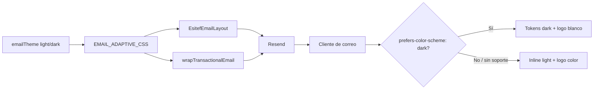

# Emails transaccionales — dark mode

Guía de referencia para tema oscuro en correos de ESITEF. Complementa [`docs/design-system/dark-mode.md`](../design-system/dark-mode.md) (runtime web con `data-theme`).

**Estado:** activo — un solo HTML adaptativo por envío.

---

## Resumen

| Aspecto | Decisión |
|---------|----------|
| Activación | `@media (prefers-color-scheme: dark)` al **abrir** el mail en el cliente |
| Meta | `color-scheme: light dark` + `supported-color-schemes: light dark` |
| Tokens | [`apps/web/src/lib/email-theme.ts`](../../apps/web/src/lib/email-theme.ts) |
| Layout React | [`apps/web/src/emails/components/esitef-layout.tsx`](../../apps/web/src/emails/components/esitef-layout.tsx) |
| HTML string | [`wrapTransactionalEmail`](../../apps/web/src/lib/email-html-wrapper.ts) + [`email-html-blocks.ts`](../../apps/web/src/lib/email-html-blocks.ts) |
| Fallback | Inline styles con tokens **light** (Gmail/Outlook que ignoran media queries) |
| Logo dark | `/img/Esitef_logo_icon_dark.png` (blanco sobre transparente; mismo criterio que navbar web) |

---

## Por qué no cookie `esitef-a11y` ni dos envíos

```
Envío (servidor)          Apertura (cliente de correo)
─────────────────         ─────────────────────────────
1 HTML con CSS light      Cliente lee prefers-color-scheme del SO
+ @media dark             → aplica tokens dark o deja fallback light
```

- La cookie de accesibilidad de la web **no viaja** al cliente de correo.
- El mail puede abrirse en otro dispositivo o app que la web.
- Enviar dos HTML (light + dark) duplicaría mensajes y no da control al usuario.
- **Estándar industria:** un HTML con estilos light inline + reglas `@media (prefers-color-scheme: dark)`.

---

## Arquitectura



### Logo dual

Dos `` con clases `.email-logo-light` / `.email-logo-dark`:

- **Light:** `Esitef_logo_icon_preloadeer.png`
- **Dark:** `Esitef_logo_icon_dark.png` — generado como marca blanca (equivalente a `filter: brightness(0) invert(1)` del navbar web)

Show/hide vía CSS en `EMAIL_ADAPTIVE_CSS`; inline `display:none` en el logo dark como fallback.

---

## Soporte por cliente

| Cliente | Dark adaptativo | Notas |
|---------|-----------------|-------|
| Apple Mail (macOS/iOS) | Sí | Referencia para QA |
| Outlook Mac | Sí | Buen soporte media queries |
| Gmail (web/app) | Parcial / no | Suele ignorar `@media` → versión light (correcto por diseño) |
| Outlook Windows | No | Motor Word; queda light |
| Android (varios) | Variable | Depende del app |

Los inline styles light son el **contrato de compatibilidad**: el mail debe verse bien aunque el cliente ignore dark mode.

---

## Verificación

```bash
cd esitef-platform/apps/web
npx tsx src/lib/site-url.check.ts
npx tsx src/lib/email-theme.check.ts
npx tsx src/lib/email-html-wrapper.check.ts
npx tsx src/emails/email-adaptive-qa.check.ts
npx tsx src/emails/newsletter-welcome.check.ts
```

### Checklist QA manual

- [ ] Render preview (`npm run dev` + ruta de preview si existe) o envío de prueba a Apple Mail con SO en oscuro
- [ ] Mismo mail en Gmail: debe verse en **light** (fondo claro, logo color)
- [ ] CTA rojo `#e3203a` con texto blanco en ambos modos
- [ ] Detail box: fondo `#1e2038`, label `#a5b4fc` en dark
- [ ] Logo blanco visible sobre card `#1a1d24` en Apple Mail dark

---

## Reglas para nuevos templates

1. Usar `EsitefEmailLayout` (React) o `wrapTransactionalEmail` + blocks (HTML string).
2. No hardcodear colores: `esitefEmailStyles` o helpers en `email-html-blocks.ts`.
3. Clases semánticas (`email-heading`, `email-detail-box`, etc.) para que `EMAIL_ADAPTIVE_CSS` aplique dark.
4. No leer preferencia de tema del usuario en el servidor al enviar.
